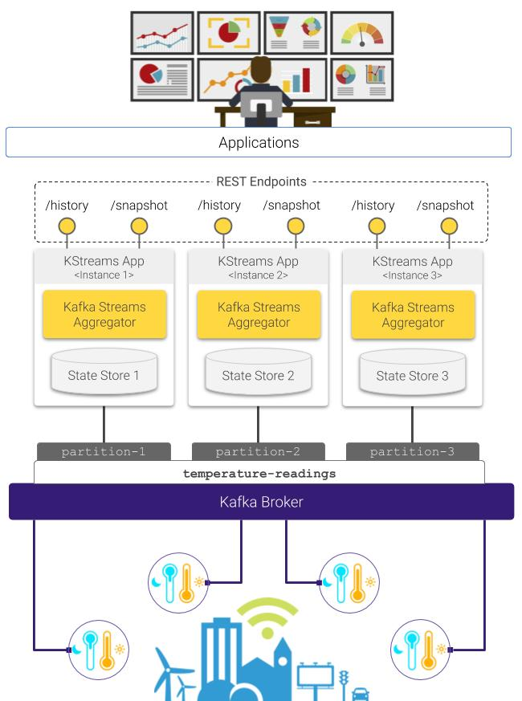

# Interactive querying with Kafka Streams

This Kafka Streams application implements a complete data pipeline, enabling the continuous aggregation of a stream of temperature measurements being posted to a Kafka topic.



## Usage

This application consumes a messages from a Kafka topic which follow the format specified next:

```json
{"timestamp": 1585054952527, "geohash": "u155mz82dv33", "sensorId":"s000001", "tempVal": 20.3, "tempUnit": "c"} 
{"timestamp": 1585080280353, "geohash": "u155krxynu5s", "sensorId":"s000002", "tempVal": 19.7, "tempUnit": "c"}
{"timestamp": 1585080335267, "geohash": "u155mz827m6q", "sensorId":"s000010", "tempVal": 24.6, "tempUnit": "c"}
{"timestamp": 1585080366564, "geohash": "u155krxynuhu", "sensorId":"s000007", "tempVal": 17.2, "tempUnit": "c"}
{"timestamp": 1585080388268, "geohash": "u155mz827v2n", "sensorId":"s000004", "tempVal": 22.2, "tempUnit": "c"}
``` 

The application described in [this blog post](https://leandro.ordonez.tech/ideas/mocking-sensor-data-generator/) is able to generate synthetic temperature readings complying with such format, and provides a `docker-compose` file for deploying a testing Kafka environment in your local machine.

### Run with Maven

To run one stream processor on you local machine, clone this repository, enter the project directory and run the following commands:

```shell script
$ mvn clean package
$ mvn exec:java -Dexec.mainClass=ingestion.KafkaStreamsAggregator \
                -Dexec.args="--geohash-precision 6 --readings-topic \"temperature-readings\""
```

The application should be now consuming the temperature measurements from the Kafka topic (`temperature-readings` by default), and computing continuous summaries on an hourly basis on a geohash-based tile grid, whose resolution is determined by the value of the `geohash-precision` argument (set to `6` by default).

The complete list of arguments the application can take is listed below:

**Argument**|**Description**
:-----|:-----
`t`, `readings-topic`|Kafka topic to consume the temperature values from. Defaults to `temperature-readings`
`gh`, `geohash-precision`|Geohash precision used to perform the continuous aggregation. Defaults to `6`
`h`, `endpoint-host`|REST endpoint hostname. Defaults to `0.0.0.0`
`p`, `endpoint-port`|REST endpoint port. Defaults to 7070
`cl`, `cleanup`|Should a cleanup be performed before staring. Defaults to false

### Run with Docker

In case you are already using the testing environment from [this blog post](https://leandro.ordonez.tech/ideas/mocking-sensor-data-generator/) you just have run the command below:

```shell script
docker run -it \
    --network="host" \
    -p 7070:7070 \
    -e GEOHASH_PRECISION=6
    kafka-streams-pipeline
```

If you have are working with a different (and remote) Kafka environment you should omit the `--network="host"` argument and set the proper environment variables:

```shell script
docker run -it \
    -p 7070:7070 \
    -e KBROKERS="<comma-separated_list_of_urls>" \
    -e READINGS_TOPIC="<topic_name>" \
    -e GEOHASH_PRECISION=6 \
    kafka-streams-pipeline
```

### Query API

This application is able to serve two types of queries: (*1*) **Historical queries**, namely those asking how the temperature has evolved along a given geospatial region, over a certain period of time; and (*2*) **Snapshot queries** which provide a time-slice view of the temperature for a specific moment in time. 

**Historical** queries are served via the `/api/temperature/aggregate/{aggregate_op}/history` endpoint.
This endpoint requires the client to specify the aggregate operation (`agregate_op`) that is to be applied (`count`, `sum` or `avg`), a comma-separated list of `geohashes` representing a polygonal region over which the query is going to be computed, and the period of time, allowing the client to choose between a predefined set of time intervals (one day, one week, one month, all history), or specify a custom time span by setting the `from` and `to` (both timestamps) parameters.

For instance, consider the following **Historical** query:

```shell script
$ curl "http://localhost:7070/api/temperature/aggregate/avg/history?interval=1day&geohashes=u155vq,u155vu" | python -m json.tool
``` 
By running the query above, the application replies with a time-series representing the average value of temperature along the polygon defined by the geohash prefixes `u155vq,u155vu`, over the last 24 hours. The response obtained from this HTTP request should be similar to this one:

```json
{
    "columns": [
        "timestamp",
        "avg"
    ],
    "data": [
        [
            1586106000000,
            22.403095841450153
        ],
        [
            1586109600000,
            22.23886750824062
        ],
        [
            1586113200000,
            21.99407402330896
        ],
        [
            1586120400000,
            19.273061437077363
        ]
    ],
    "metadata": {
        "metric": "temperature"
    }
}
```
**Snapshot** queries are served via the `/api/temperature/aggregate/{aggregate_op}/snapshot` endpoint.
This endpoint requires the client to specify again the aggregate operation (`agregate_op`) that is to be applied (`count`, `sum` or `avg`), the snapshot timestamp `ts`, and the snapshot bounding box (`bbox`) (as a comma-separated sequence of coordinates: `<north>,<west>,<south>,<easth>`)

By running the query below:

```shell script
$ curl "http://localhost:7070/api/temperature/aggregate/avg/snapshot?ts=1586109600000&bbox=51.32288838086245,4.091720581054688,51.1509246836981,4.752960205078125 | python -m json.tool
```
The application reports the average temperature over the region covered by the specified bounding box, at `1586109600000` (April 5, 2020 6:00:00 PM GMT). 
The response is provided as a list of tuples `[geohash, aggregate_value]`, as shown in the example below:

```json
{
    "columns": [
        "geohash",
        "avg"
    ],
    "data": [
        [
            "u14fzp",
            22.36663999975746
        ],
        [
            "u14gj2",
            22.061362380805726
        ],
        [
            "u14gj6",
            21.9449607615796
        ],
        ...
    ],
    "metadata": {
        "metric": "temperature"
    }
}
```
